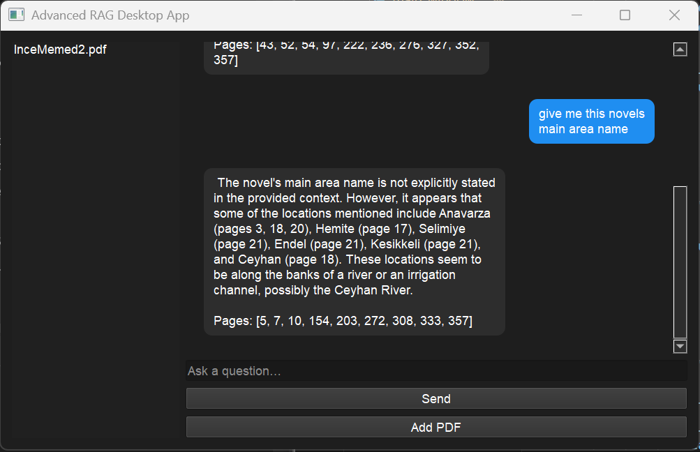

# 🧠 Advanced RAG Desktop App  
**PyQt5 · FAISS · SentenceTransformers · Ollama · Cross-Encoder Reranking**

A fully local **Retrieval-Augmented Generation (RAG)** desktop application that allows users to upload PDFs, build vector indexes, and chat with an LLM that answers **strictly based on the document content**.

The application combines a modern desktop UI with a production-grade RAG pipeline including semantic search, reranking, conversation memory, and page-level citation.

---

## 🚀 What This App Does

This system turns any PDF into a searchable AI assistant.

You upload a PDF → it is chunked → embedded → indexed in FAISS → and then queried through a multi-stage RAG pipeline backed by Ollama.

The LLM never hallucinates outside of the document.

---

## ✨ Key Features

- 📄 **PDF ingestion & parsing**
- ✂️ **Smart chunking with page tracking**
- 🧠 **SentenceTransformer embeddings**
- ⚡ **FAISS vector index**
- 🎯 **Cross-Encoder reranking**
- 💬 **Conversational RAG with memory**
- 📚 **Page-level citation**
- 🖥 **Modern PyQt5 desktop UI**
- ⏳ **Modal loading dialog with real batch-based progress**
- 🗂 **Multi-PDF sidebar**

---

## 🖼 UI Preview

### Main Chat Interface  
WhatsApp-style chat bubbles with source citations



---

## 🏗 Architecture

```text
PyQt5 UI
 └── MainWindow
      └── RAGController
           ├── PDF Loader (NLTK + PyPDF)
           ├── Chunker (page-aware)
           ├── SentenceTransformer Embedder
           ├── FAISS Vector Store
           ├── Cross-Encoder Reranker
           ├── Ollama LLM
           └── ChatMemory
